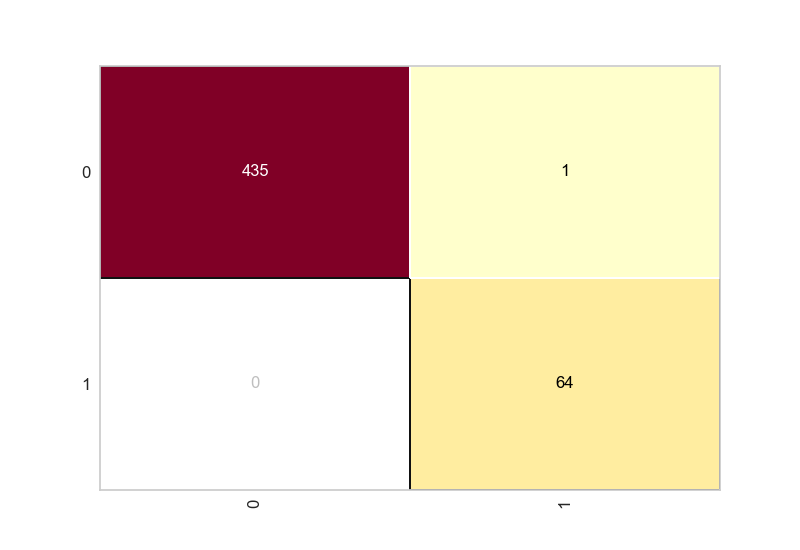
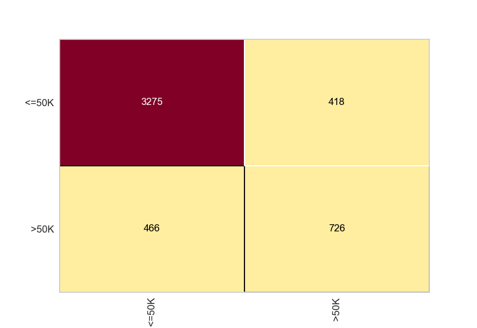

# 🔍 Classificação com Redes Neurais: Credit & Census


## 📌 Descrição

Este projeto aplica **redes neurais artificiais (MLPClassifier)** com `scikit-learn` em dois conjuntos de dados populares:

- 🏦 **Credit Dataset**: previsão de risco de crédito.
- 🧑‍💼 **Census Dataset**: previsão de faixa salarial com base em dados demográficos.

O objetivo é **avaliar o desempenho de redes neurais** em diferentes contextos, utilizando métricas de acurácia e relatórios de classificação.

---

## 🧠 Técnicas Utilizadas

- 🔢 **Redes Neurais (MLPClassifier)** com diferentes arquiteturas
- 📊 **Métricas de avaliação**: Accuracy, Precision, Recall, F1-Score
- 📉 **Visualização**: Matriz de Confusão com Yellowbrick

---

#### Modelo de Crédito:

* Acurácia: `[1.0]`



 **classification_report_ credit**

                   precision    recall  f1-score   support

              0        1.00      1.00      1.00       436
               1       1.00      1.00      1.00        64

        accuracy                           1.00       500
       macro avg       1.00      1.00      1.00       500
    weighted avg       1.00      1.00      1.00       500


#### Modelo Census:

* Acurácia: `[0.818]`



 **classification_report_ census**
 
                    precision    recall  f1-score   support

           <=50K       0.87      0.89      0.88      3693
            >50K       0.64      0.59      0.61      1192

        accuracy                           0.82      4885
       macro avg       0.75      0.74      0.75      4885
    weighted avg       0.81      0.82      0.82      4885


---

## 📁 Estrutura do Projeto

```
📦 projeto-redes-neurais/
├── credit.pkl
├── census.pkl
├── mpl_classifier.py
├── mpl_classifier.py
├── requirements.txt
└── README.md
```

---

## 📊 Resultados Esperados

Ao final da execução, você verá:
- Acurácia de cada modelo treinado
- Matriz de confusão para avaliação visual
- Classificação detalhada com precisão, recall e F1-score

---

## 💡 Possíveis Melhorias

- Normalização dos dados
- Validação cruzada
- Ajuste de hiperparâmetros com GridSearchCV
- Salvamento dos modelos treinados

---

## 👨‍💻 Desenvolvido por

**Daniel Coelho**  
🔗 [LinkedIn](https://www.linkedin.com/in/seu-linkedin)  
💻 [GitHub](https://github.com/seu-github)

---

## ⭐ Dê uma estrela

Se você gostou do projeto, não esqueça de deixar uma ⭐ no repositório!
